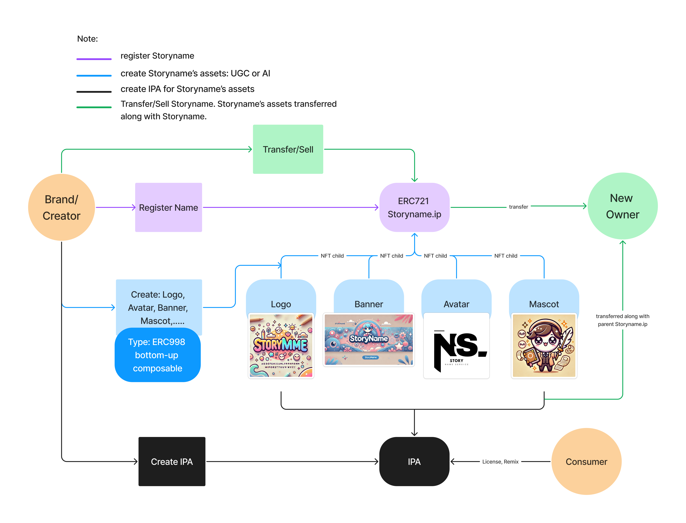

# STORYNAMES

This repository contains code for minting and managing .ip domains using the Story Name Service, the official naming and branding infrastructure of the Story Protocol network.

Storynames enables users to establish on-chain identities, create custom web3 profiles, and manage brand IP assets directly within the decentralized Story Protocol ecosystem.

### FEATURES

- **.ip Domain Registration**: Secure a unique .ip domain to establish your on-chain identity or brand presence.
- **Public Resolver Management**: Set and manage address records, text records, and DNS records using an integrated resolver system.
- **Custom Branding Integration**: Link your .ip domain with logos, banners, and other brand assets for enhanced identity management.
- **Tokenized Domains**: Register .ip domains as ERC721 tokens, tradeable on platforms like Color.

### OVERVIEW

The Story Name Service (SNS) is a foundational component of the Story Protocol network, providing a flexible and decentralized naming system that empowers creators, brands, and users to:

- Claim human-readable .ip names for wallet addresses.
- Create and license branded assets linked to their .ip identity.
- Build personalized web3 profiles within the Story ecosystem.
Story Name Service utilizes a modified implementation of ENS (Ethereum Name Service) technology, optimized for Story Protocol’s branding and identity requirements.

### CONTRACT ADDRESSES

#### Odyssey Testnet

| Contract | Address | 
| -------- | ------- | 
| Registry | [0x18e72142258dC6494C1998835292DbD3a4494565](https://odyssey.storyscan.xyz/address/0x18e72142258dC6494C1998835292DbD3a4494565) | 
| StoryRegistrar | [0x707d06A17C7f1183530B27995e590eC31cAaE026](https://odyssey.storyscan.xyz/address/0x707d06A17C7f1183530B27995e590eC31cAaE026) | 
| RegistrarController | [0x8487Fd1b80DA423AaF81B9eab9EAfDD9473FDAbA](https://odyssey.storyscan.xyz/address/0x8487Fd1b80DA423AaF81B9eab9EAfDD9473FDAbA) |
| Price Oracle | [0x40d8B9B948Ea2fB132A9CA1Ca66D9A38fae5dcaE](https://odyssey.storyscan.xyz/address/0x40d8B9B948Ea2fB132A9CA1Ca66D9A38fae5dcaE) | 
| ReverseRegistrar | [0xf89592B25D4b07bAbD06566ac95864928Dc55eB7](https://odyssey.storyscan.xyz/address/0xf89592B25D4b07bAbD06566ac95864928Dc55eB7) | 
| StoryResolver | [0x961f839dB4658Ca8b3dd6f78D4D3aFFfa893B9db](https://odyssey.storyscan.xyz/address/0x961f839dB4658Ca8b3dd6f78D4D3aFFfa893B9db) | 

## Functional Diagram

The system architecture can be functionally organized into three categories:
1. The .ip domains can be linked to IP Bramd Assets, enhancing brand recognition and discoverability within the Story Protocol ecosystem.
2. Creators register their Brand Asset as on-chain IP Assets, represented by NFTs, interacts with various modules to manage functionalities like licensing and royalties.
3. The Brand IPA is linked to its .ip domain using ComposableSPG contract



### ARCHITECTURE

The SNS architecture adopts and enhances ENS standards to align with Story Protocol’s requirements. Key components include:

| Contract                | Role                           | Description                                          |
|-------------------------|--------------------------------|------------------------------------------------------|
| **Registry**            | Manages `.ip` domain records  | Stores records of all registered `.ip` domains.     |
| **StoryRegistrar**      | Tokenizes `.ip` domains       | Manages ownership and expiration of `.ip` names.    |
| **ReverseRegistrar**    | Reverse mapping for addresses | Allows assigning primary names to wallet addresses. |
| **StoryResolver**       | Record storage for `.ip` domains | Stores metadata, DNS, and branding records.       |
| **RegistrarController** | Domain registration and pricing | Facilitates payment and pricing of domain names.   |
| **Stable Price Oracle** | Registration pricing          | Calculates prices based on name length and duration.|
| **Exponential Premium Oracle** | Dutch auction pricing  | Sets dynamic prices for expired names.             |


The SNS supports additional features, such as promotional discounts, to encourage adoption. Discounts are validated using the following interface:
```solidity
// SPDX-License-Identifier: MIT
pragma solidity ^0.8.23;

/// @title Discount Validator Interface
///
/// @notice Common interface which all Discount Validators must implement.
///         The logic specific to each integration must ultimately be consumable as the `bool` returned from
///         `isValidDiscountRegistration`.
interface IDiscountValidator {
    /// @notice Required implementation for compatibility with IDiscountValidator.
    ///
    /// @dev Each implementation will have unique requirements for the data necessary to perform
    ///     a meaningul validation. Implementations must describe here how to pack relevant `validationData`.
    ///     Ex: `bytes validationData = abi.encode(bytes32 key, bytes32[] proof)`
    ///
    /// @param claimer the discount claimer's address.
    /// @param validationData opaque bytes for performing the validation.
    ///
    /// @return `true` if the validation data provided is determined to be valid for the specified claimer, else `false`.
    function isValidDiscountRegistration(address claimer, bytes calldata validationData) external returns (bool);
}
```
The various implementations can be found [in this directory](https://github.com/LumoraLabs/storynames/tree/main/src/contract/discounts). 

## Usage

### Build

```shell
$ forge build
```

### Test

```shell
$ forge test
```

### Format

```shell
$ forge fmt
```

### Gas Snapshots

```shell
$ forge snapshot
```

### Help

```shell
$ forge --help
$ anvil --help
$ cast --help
```
